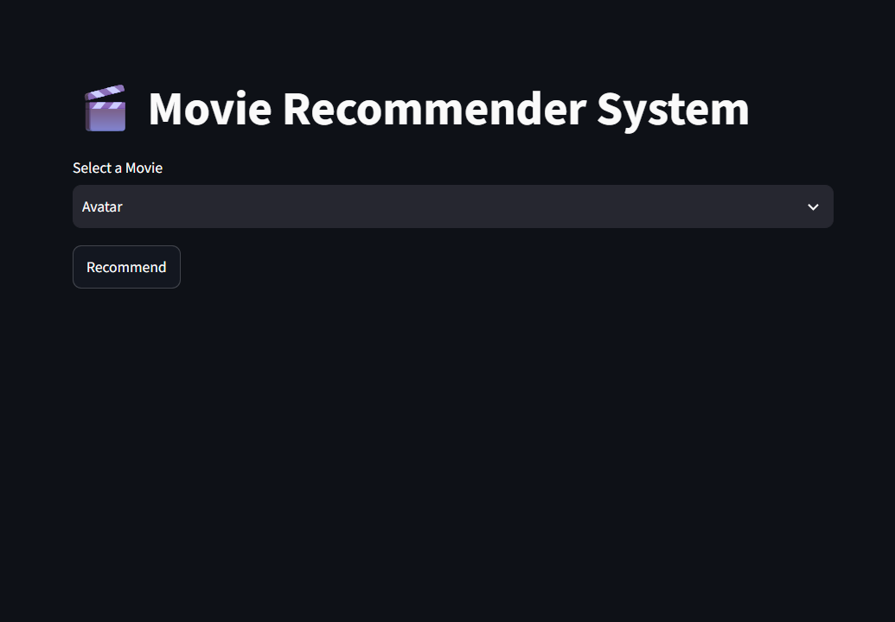
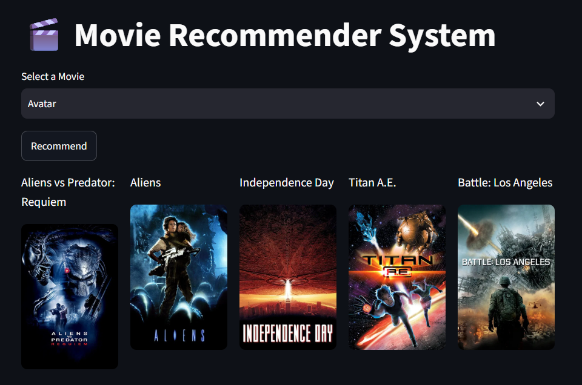

# 🎬 Movie Recommender System

A Content-Based Movie Recommendation System built using Machine Learning and Streamlit.

## 🚀 Live Demo

👉 **Try the application here:**  
https://abhishek-movie-recommender.streamlit.app/

---

## 📌 Features

- Recommend 5 similar movies instantly
- Movie posters fetched from TMDB API
- Fast recommendation using cosine similarity
- Interactive Streamlit UI
- Search from 4800+ movies

---

## 🛠 Tech Stack

- Python
- Pandas
- NumPy
- Scikit-Learn
- Streamlit
- TMDB API
- Pickle

---

## 📂 Dataset

TMDB 5000 Movies Dataset

- tmdb_5000_movies.csv
- tmdb_5000_credits.csv

---

## ⚙️ Machine Learning Pipeline

1. Data Cleaning
2. Feature Engineering
3. Combine important textual features
4. Text Vectorization using CountVectorizer
5. Cosine Similarity
6. Recommendation Generation

---

## 📸 Screenshots

### Home Page



### Recommendations



---

## Installation

```bash
git clone https://github.com/abhi01-sys/Movie-Recommender-system.git

cd Movie-Recommender-system

pip install -r requirements.txt

streamlit run app.py
```

---

## Project Structure

```
Movie-Recommender-System/
│── app.py
│── Movie_Recommender_System.ipynb
│── movies_dict.pkl
│── similarity.pkl
│── requirements.txt
│── tmdb_5000_movies.csv
│── tmdb_5000_credits.csv
```

---

## Future Improvements

- User Login
- Collaborative Filtering
- Hybrid Recommendation System
- Movie Trailers
- User Ratings
- Search Suggestions

---

## Author

**Abhishek Nagar**

B.Tech Artificial Intelligence

MITS Gwalior

GitHub:
https://github.com/abhi01-sys
